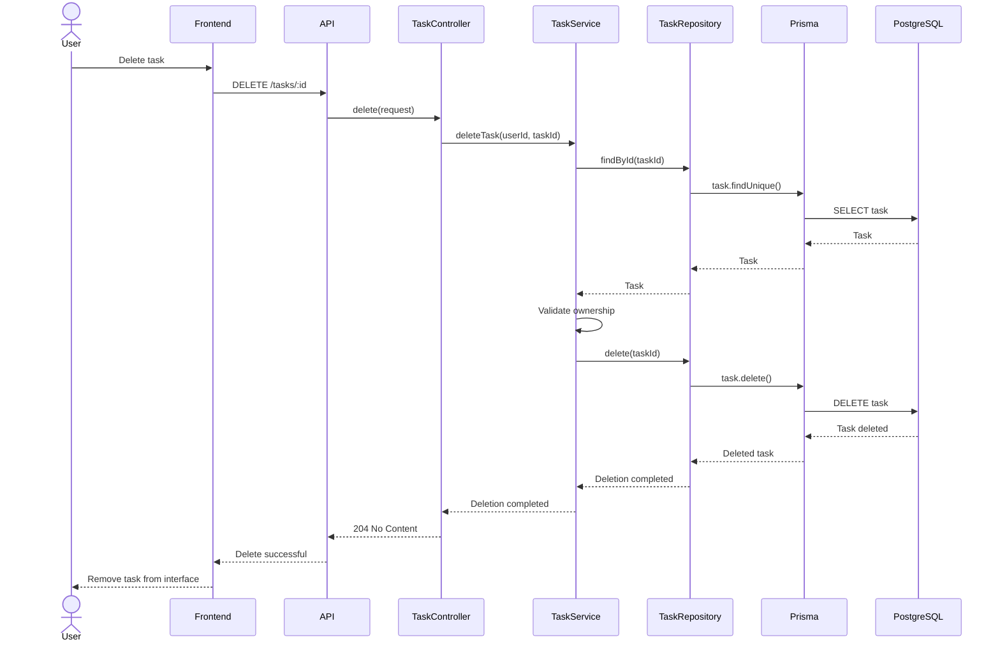

# Sequence Diagram - Task - Delete

```mermaid
sequenceDiagram

    actor User

    participant Frontend

    participant API

    participant TaskController

    participant TaskService

    participant TaskRepository

    participant Prisma

    participant PostgreSQL

    User->>Frontend: Delete task

    Frontend->>API: DELETE /tasks/:id

    API->>TaskController: delete(request)

    TaskController->>TaskService: deleteTask(userId, taskId)

    TaskService->>TaskRepository: findById(taskId)

    TaskRepository->>Prisma: task.findUnique()

    Prisma->>PostgreSQL: SELECT task

    PostgreSQL-->>Prisma: Task

    Prisma-->>TaskRepository: Task

    TaskRepository-->>TaskService: Task

    TaskService->>TaskService: Validate ownership

    TaskService->>TaskRepository: delete(taskId)

    TaskRepository->>Prisma: task.delete()

    Prisma->>PostgreSQL: DELETE task

    PostgreSQL-->>Prisma: Task deleted

    Prisma-->>TaskRepository: Deleted task

    TaskRepository-->>TaskService: Deletion completed

    TaskService-->>TaskController: Deletion completed

    TaskController-->>API: 204 No Content

    API-->>Frontend: Delete successful

    Frontend-->>User: Remove task from interface
```
