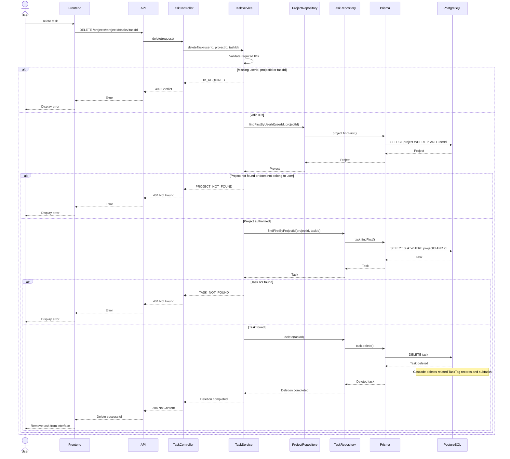

# Task - Delete

```mermaid
sequenceDiagram

    actor User

    participant Frontend
    participant API
    participant TaskController
    participant TaskService
    participant ProjectRepository
    participant TaskRepository
    participant Prisma
    participant PostgreSQL

    User->>Frontend: Delete task

    Frontend->>API: DELETE /projects/:projectId/tasks/:taskId

    API->>TaskController: delete(request)

    TaskController->>TaskService: deleteTask(userId, projectId, taskId)

    TaskService->>TaskService: Validate required IDs

    alt Missing userId, projectId or taskId
        TaskService-->>TaskController: ID_REQUIRED
        TaskController-->>API: 409 Conflict
        API-->>Frontend: Error
        Frontend-->>User: Display error
    else Valid IDs

        TaskService->>ProjectRepository: findFirstByUserId(userId, projectId)

        ProjectRepository->>Prisma: project.findFirst()

        Prisma->>PostgreSQL: SELECT project WHERE id AND userId

        PostgreSQL-->>Prisma: Project

        Prisma-->>ProjectRepository: Project

        ProjectRepository-->>TaskService: Project

        alt Project not found or does not belong to user
            TaskService-->>TaskController: PROJECT_NOT_FOUND
            TaskController-->>API: 404 Not Found
            API-->>Frontend: Error
            Frontend-->>User: Display error
        else Project authorized

            TaskService->>TaskRepository: findFirstByProjectId(projectId, taskId)

            TaskRepository->>Prisma: task.findFirst()

            Prisma->>PostgreSQL: SELECT task WHERE projectId AND id

            PostgreSQL-->>Prisma: Task

            Prisma-->>TaskRepository: Task

            TaskRepository-->>TaskService: Task

            alt Task not found
                TaskService-->>TaskController: TASK_NOT_FOUND
                TaskController-->>API: 404 Not Found
                API-->>Frontend: Error
                Frontend-->>User: Display error
            else Task found

                TaskService->>TaskRepository: delete(taskId)

                TaskRepository->>Prisma: task.delete()

                Prisma->>PostgreSQL: DELETE task

                PostgreSQL-->>Prisma: Task deleted
                Note over PostgreSQL: Cascade deletes related TaskTag records and subtasks

                Prisma-->>TaskRepository: Deleted task

                TaskRepository-->>TaskService: Deletion completed

                TaskService-->>TaskController: Deletion completed

                TaskController-->>API: 204 No Content

                API-->>Frontend: Delete successful

                Frontend-->>User: Remove task from interface
            end
        end
    end
```
