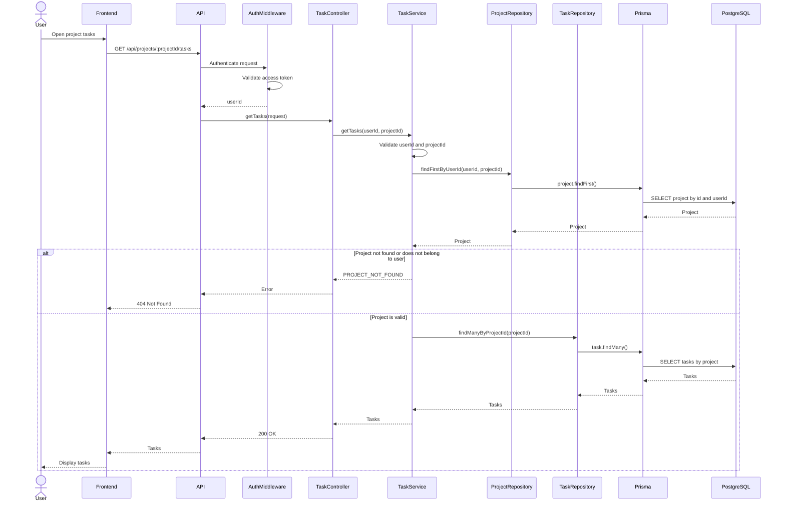
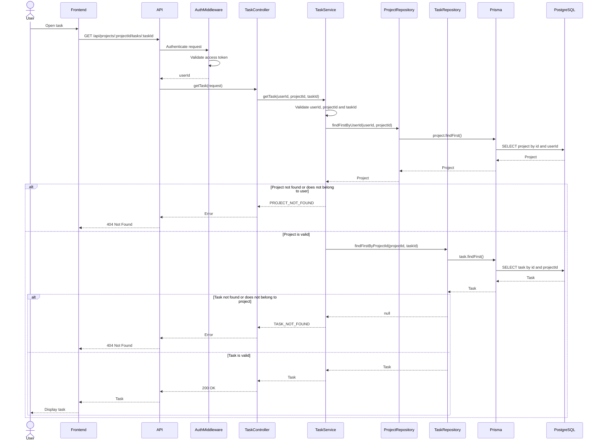

# Task - Get

## Get Tasks

```mermaid
sequenceDiagram
    actor User
    participant Frontend
    participant API
    participant AuthMiddleware
    participant TaskController
    participant TaskService
    participant ProjectRepository
    participant TaskRepository
    participant Prisma
    participant PostgreSQL

    User->>Frontend: Open project tasks
    Frontend->>API: GET /api/projects/:projectId/tasks
    API->>AuthMiddleware: Authenticate request
    AuthMiddleware->>AuthMiddleware: Validate access token
    AuthMiddleware-->>API: userId

    API->>TaskController: getTasks(request)
    TaskController->>TaskService: getTasks(userId, projectId)

    TaskService->>TaskService: Validate userId and projectId

    TaskService->>ProjectRepository: findFirstByUserId(userId, projectId)
    ProjectRepository->>Prisma: project.findFirst()
    Prisma->>PostgreSQL: SELECT project by id and userId
    PostgreSQL-->>Prisma: Project
    Prisma-->>ProjectRepository: Project
    ProjectRepository-->>TaskService: Project

    alt Project not found or does not belong to user
        TaskService-->>TaskController: PROJECT_NOT_FOUND
        TaskController-->>API: Error
        API-->>Frontend: 404 Not Found
    else Project is valid
        TaskService->>TaskRepository: findManyByProjectId(projectId)
        TaskRepository->>Prisma: task.findMany()
        Prisma->>PostgreSQL: SELECT tasks by project
        PostgreSQL-->>Prisma: Tasks
        Prisma-->>TaskRepository: Tasks
        TaskRepository-->>TaskService: Tasks

        TaskService-->>TaskController: Tasks
        TaskController-->>API: 200 OK
        API-->>Frontend: Tasks
        Frontend-->>User: Display tasks
    end
```

## Get Task

```mermaid
sequenceDiagram
    actor User
    participant Frontend
    participant API
    participant AuthMiddleware
    participant TaskController
    participant TaskService
    participant ProjectRepository
    participant TaskRepository
    participant Prisma
    participant PostgreSQL

    User->>Frontend: Open task
    Frontend->>API: GET /api/projects/:projectId/tasks/:taskId
    API->>AuthMiddleware: Authenticate request
    AuthMiddleware->>AuthMiddleware: Validate access token
    AuthMiddleware-->>API: userId

    API->>TaskController: getTask(request)
    TaskController->>TaskService: getTask(userId, projectId, taskId)

    TaskService->>TaskService: Validate userId, projectId and taskId

    TaskService->>ProjectRepository: findFirstByUserId(userId, projectId)
    ProjectRepository->>Prisma: project.findFirst()
    Prisma->>PostgreSQL: SELECT project by id and userId
    PostgreSQL-->>Prisma: Project
    Prisma-->>ProjectRepository: Project
    ProjectRepository-->>TaskService: Project

    alt Project not found or does not belong to user
        TaskService-->>TaskController: PROJECT_NOT_FOUND
        TaskController-->>API: Error
        API-->>Frontend: 404 Not Found
    else Project is valid
        TaskService->>TaskRepository: findFirstByProjectId(projectId, taskId)
        TaskRepository->>Prisma: task.findFirst()
        Prisma->>PostgreSQL: SELECT task by id and projectId
        PostgreSQL-->>Prisma: Task
        Prisma-->>TaskRepository: Task

        alt Task not found or does not belong to project
            TaskRepository-->>TaskService: null
            TaskService-->>TaskController: TASK_NOT_FOUND
            TaskController-->>API: Error
            API-->>Frontend: 404 Not Found
        else Task is valid
            TaskRepository-->>TaskService: Task
            TaskService-->>TaskController: Task
            TaskController-->>API: 200 OK
            API-->>Frontend: Task
            Frontend-->>User: Display task
        end
    end
```
