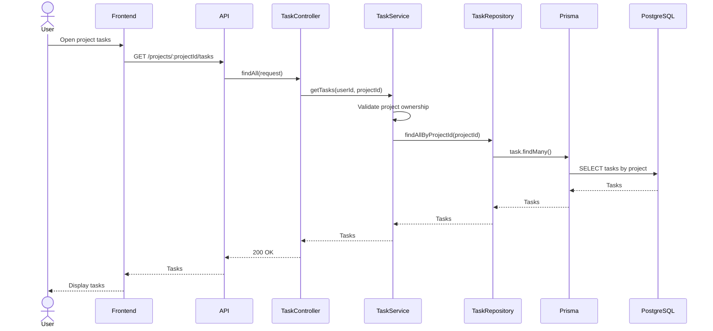
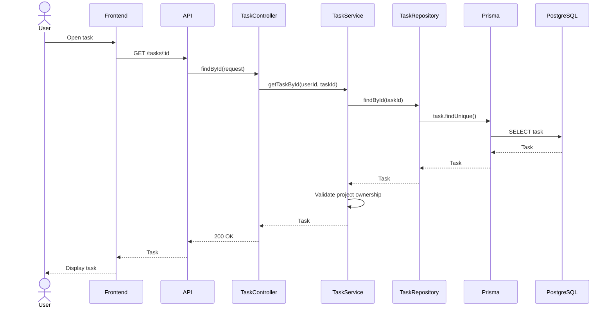

# Sequence Diagram - Task - Get

## Get Tasks

```mermaid
sequenceDiagram

    actor User

    participant Frontend

    participant API

    participant TaskController

    participant TaskService

    participant TaskRepository

    participant Prisma

    participant PostgreSQL

    User->>Frontend: Open project tasks

    Frontend->>API: GET /projects/:projectId/tasks

    API->>TaskController: findAll(request)

    TaskController->>TaskService: getTasks(userId, projectId)

    TaskService->>TaskService: Validate project ownership

    TaskService->>TaskRepository: findAllByProjectId(projectId)

    TaskRepository->>Prisma: task.findMany()

    Prisma->>PostgreSQL: SELECT tasks by project

    PostgreSQL-->>Prisma: Tasks

    Prisma-->>TaskRepository: Tasks

    TaskRepository-->>TaskService: Tasks

    TaskService-->>TaskController: Tasks

    TaskController-->>API: 200 OK

    API-->>Frontend: Tasks

    Frontend-->>User: Display tasks
```

## Get Task

```mermaid
sequenceDiagram

    actor User

    participant Frontend

    participant API

    participant TaskController

    participant TaskService

    participant TaskRepository

    participant Prisma

    participant PostgreSQL

    User->>Frontend: Open task

    Frontend->>API: GET /tasks/:id

    API->>TaskController: findById(request)

    TaskController->>TaskService: getTaskById(userId, taskId)

    TaskService->>TaskRepository: findById(taskId)

    TaskRepository->>Prisma: task.findUnique()

    Prisma->>PostgreSQL: SELECT task

    PostgreSQL-->>Prisma: Task

    Prisma-->>TaskRepository: Task

    TaskRepository-->>TaskService: Task

    TaskService->>TaskService: Validate project ownership

    TaskService-->>TaskController: Task

    TaskController-->>API: 200 OK

    API-->>Frontend: Task

    Frontend-->>User: Display task
```
