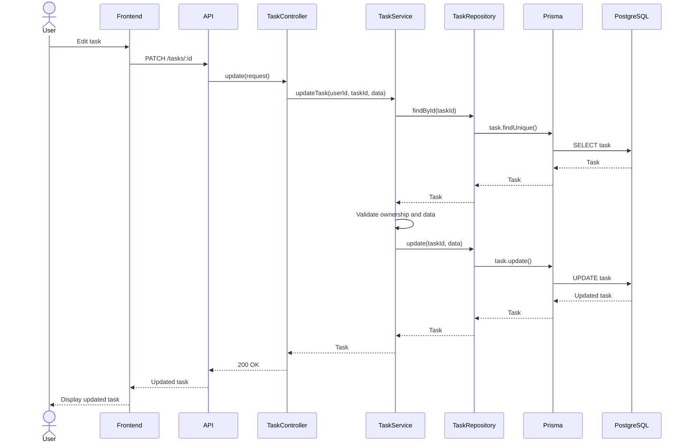

# Sequence Diagram - Task - Update

```mermaid
sequenceDiagram

    actor User

    participant Frontend

    participant API

    participant TaskController

    participant TaskService

    participant TaskRepository

    participant Prisma

    participant PostgreSQL

    User->>Frontend: Edit task

    Frontend->>API: PATCH /tasks/:id

    API->>TaskController: update(request)

    TaskController->>TaskService: updateTask(userId, taskId, data)

    TaskService->>TaskRepository: findById(taskId)

    TaskRepository->>Prisma: task.findUnique()

    Prisma->>PostgreSQL: SELECT task

    PostgreSQL-->>Prisma: Task

    Prisma-->>TaskRepository: Task

    TaskRepository-->>TaskService: Task

    TaskService->>TaskService: Validate ownership and data

    TaskService->>TaskRepository: update(taskId, data)

    TaskRepository->>Prisma: task.update()

    Prisma->>PostgreSQL: UPDATE task

    PostgreSQL-->>Prisma: Updated task

    Prisma-->>TaskRepository: Task

    TaskRepository-->>TaskService: Task

    TaskService-->>TaskController: Task

    TaskController-->>API: 200 OK

    API-->>Frontend: Updated task

    Frontend-->>User: Display updated task
```
