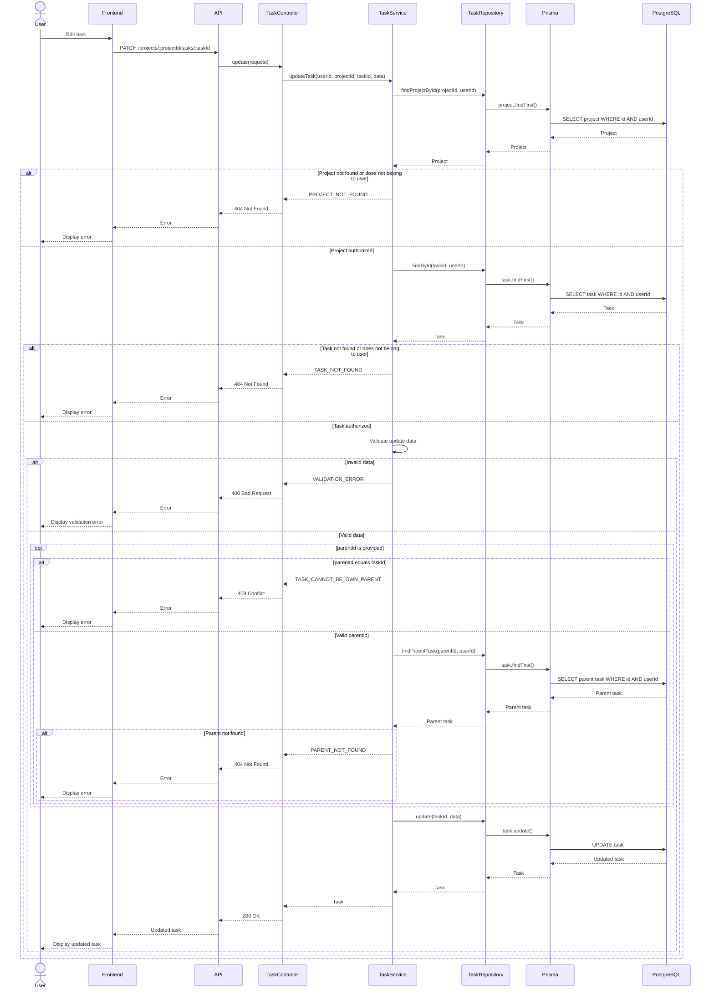

# Task - Update

```mermaid
sequenceDiagram

    actor User

    participant Frontend
    participant API
    participant TaskController
    participant TaskService
    participant TaskRepository
    participant Prisma
    participant PostgreSQL

    User->>Frontend: Edit task

    Frontend->>API: PATCH /projects/:projectId/tasks/:taskId

    API->>TaskController: update(request)

    TaskController->>TaskService: updateTask(userId, projectId, taskId, data)

    TaskService->>TaskRepository: findProjectById(projectId, userId)

    TaskRepository->>Prisma: project.findFirst()

    Prisma->>PostgreSQL: SELECT project WHERE id AND userId

    PostgreSQL-->>Prisma: Project

    Prisma-->>TaskRepository: Project

    TaskRepository-->>TaskService: Project

    alt Project not found or does not belong to user
        TaskService-->>TaskController: PROJECT_NOT_FOUND
        TaskController-->>API: 404 Not Found
        API-->>Frontend: Error
        Frontend-->>User: Display error
    else Project authorized

        TaskService->>TaskRepository: findById(taskId, userId)

        TaskRepository->>Prisma: task.findFirst()

        Prisma->>PostgreSQL: SELECT task WHERE id AND userId

        PostgreSQL-->>Prisma: Task

        Prisma-->>TaskRepository: Task

        TaskRepository-->>TaskService: Task

        alt Task not found or does not belong to user
            TaskService-->>TaskController: TASK_NOT_FOUND
            TaskController-->>API: 404 Not Found
            API-->>Frontend: Error
            Frontend-->>User: Display error
        else Task authorized

            TaskService->>TaskService: Validate update data

            alt Invalid data
                TaskService-->>TaskController: VALIDATION_ERROR
                TaskController-->>API: 400 Bad Request
                API-->>Frontend: Error
                Frontend-->>User: Display validation error
            else Valid data

                opt parentId is provided
                    alt parentId equals taskId
                        TaskService-->>TaskController: TASK_CANNOT_BE_OWN_PARENT
                        TaskController-->>API: 409 Conflict
                        API-->>Frontend: Error
                        Frontend-->>User: Display error
                    else Valid parentId

                        TaskService->>TaskRepository: findParentTask(parentId, userId)

                        TaskRepository->>Prisma: task.findFirst()

                        Prisma->>PostgreSQL: SELECT parent task WHERE id AND userId

                        PostgreSQL-->>Prisma: Parent task

                        Prisma-->>TaskRepository: Parent task

                        TaskRepository-->>TaskService: Parent task

                        alt Parent not found
                            TaskService-->>TaskController: PARENT_NOT_FOUND
                            TaskController-->>API: 404 Not Found
                            API-->>Frontend: Error
                            Frontend-->>User: Display error
                        end
                    end
                end

                TaskService->>TaskRepository: update(taskId, data)

                TaskRepository->>Prisma: task.update()

                Prisma->>PostgreSQL: UPDATE task

                PostgreSQL-->>Prisma: Updated task

                Prisma-->>TaskRepository: Task

                TaskRepository-->>TaskService: Task

                TaskService-->>TaskController: Task

                TaskController-->>API: 200 OK

                API-->>Frontend: Updated task

                Frontend-->>User: Display updated task
            end
        end
    end
```
