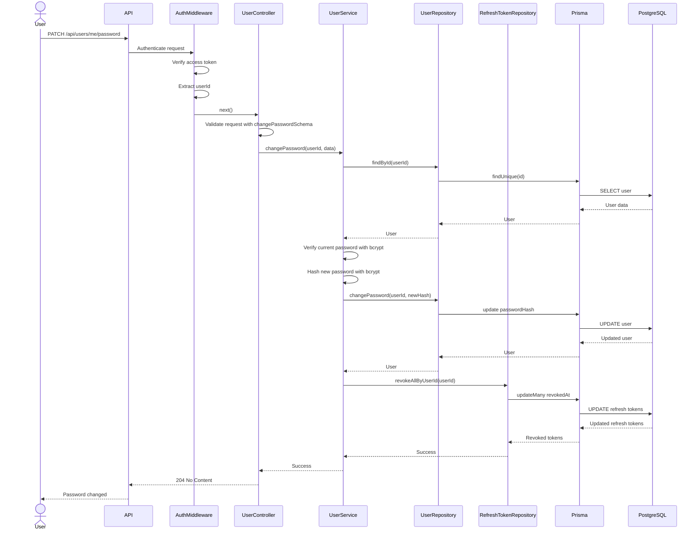

# User - Change Password

```mermaid
sequenceDiagram
    actor User
    participant API
    participant AuthMiddleware
    participant UserController
    participant UserService
    participant UserRepository
    participant RefreshTokenRepository
    participant Prisma
    participant PostgreSQL

    User->>API: PATCH /api/users/me/password
    API->>AuthMiddleware: Authenticate request
    AuthMiddleware->>AuthMiddleware: Verify access token
    AuthMiddleware->>AuthMiddleware: Extract userId
    AuthMiddleware->>UserController: next()

    UserController->>UserController: Validate request with changePasswordSchema
    UserController->>UserService: changePassword(userId, data)

    UserService->>UserRepository: findById(userId)
    UserRepository->>Prisma: findUnique(id)
    Prisma->>PostgreSQL: SELECT user
    PostgreSQL-->>Prisma: User data
    Prisma-->>UserRepository: User
    UserRepository-->>UserService: User

    UserService->>UserService: Verify current password with bcrypt
    UserService->>UserService: Hash new password with bcrypt

    UserService->>UserRepository: changePassword(userId, newHash)
    UserRepository->>Prisma: update passwordHash
    Prisma->>PostgreSQL: UPDATE user
    PostgreSQL-->>Prisma: Updated user
    Prisma-->>UserRepository: User
    UserRepository-->>UserService: User

    UserService->>RefreshTokenRepository: revokeAllByUserId(userId)
    RefreshTokenRepository->>Prisma: updateMany revokedAt
    Prisma->>PostgreSQL: UPDATE refresh tokens
    PostgreSQL-->>Prisma: Updated refresh tokens
    Prisma-->>RefreshTokenRepository: Revoked tokens
    RefreshTokenRepository-->>UserService: Success

    UserService-->>UserController: Success
    UserController-->>API: 204 No Content
    API-->>User: Password changed
```
