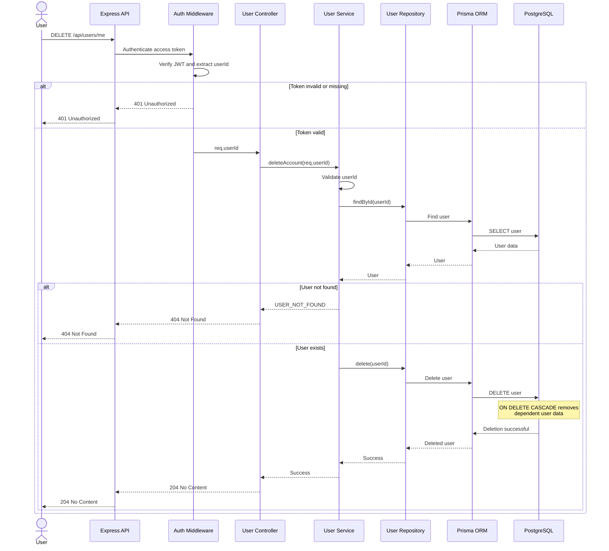

# User - Delete Account

```mermaid
sequenceDiagram
    actor User
    participant API as Express API
    participant Auth as Auth Middleware
    participant Controller as User Controller
    participant Service as User Service
    participant Repository as User Repository
    participant Prisma as Prisma ORM
    participant DB as PostgreSQL

    User->>API: DELETE /api/users/me
    API->>Auth: Authenticate access token
    Auth->>Auth: Verify JWT and extract userId

    alt Token invalid or missing
        Auth-->>API: 401 Unauthorized
        API-->>User: 401 Unauthorized
    else Token valid
        Auth->>Controller: req.userId
        Controller->>Service: deleteAccount(req.userId)

        Service->>Service: Validate userId
        Service->>Repository: findById(userId)
        Repository->>Prisma: Find user
        Prisma->>DB: SELECT user
        DB-->>Prisma: User data
        Prisma-->>Repository: User
        Repository-->>Service: User

        alt User not found
            Service-->>Controller: USER_NOT_FOUND
            Controller-->>API: 404 Not Found
            API-->>User: 404 Not Found
        else User exists
            Service->>Repository: delete(userId)
            Repository->>Prisma: Delete user
            Prisma->>DB: DELETE user

            Note over DB: ON DELETE CASCADE removes<br/>dependent user data

            DB-->>Prisma: Deletion successful
            Prisma-->>Repository: Deleted user
            Repository-->>Service: Success
            Service-->>Controller: Success
            Controller-->>API: 204 No Content
            API-->>User: 204 No Content
        end
    end
```
