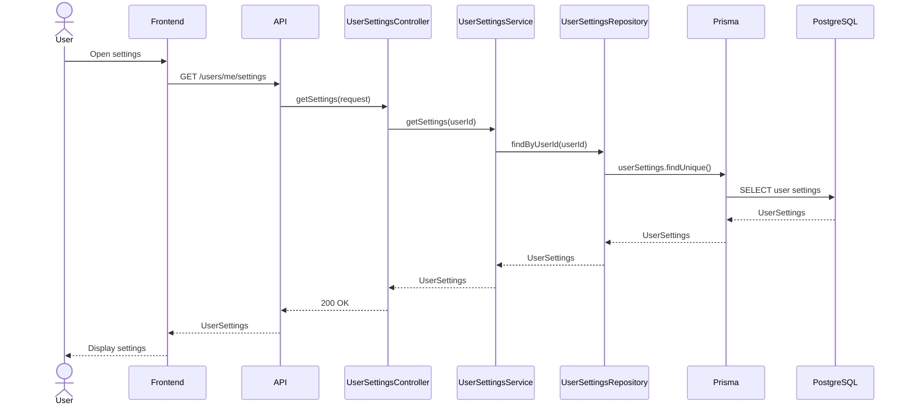

# Sequence Diagram - User/UserSettings - Get Settings

```mermaid
sequenceDiagram

    actor User

    participant Frontend

    participant API

    participant UserSettingsController

    participant UserSettingsService

    participant UserSettingsRepository

    participant Prisma

    participant PostgreSQL

    User->>Frontend: Open settings

    Frontend->>API: GET /users/me/settings

    API->>UserSettingsController: getSettings(request)

    UserSettingsController->>UserSettingsService: getSettings(userId)

    UserSettingsService->>UserSettingsRepository: findByUserId(userId)

    UserSettingsRepository->>Prisma: userSettings.findUnique()

    Prisma->>PostgreSQL: SELECT user settings

    PostgreSQL-->>Prisma: UserSettings

    Prisma-->>UserSettingsRepository: UserSettings

    UserSettingsRepository-->>UserSettingsService: UserSettings

    UserSettingsService-->>UserSettingsController: UserSettings

    UserSettingsController-->>API: 200 OK

    API-->>Frontend: UserSettings

    Frontend-->>User: Display settings
```
