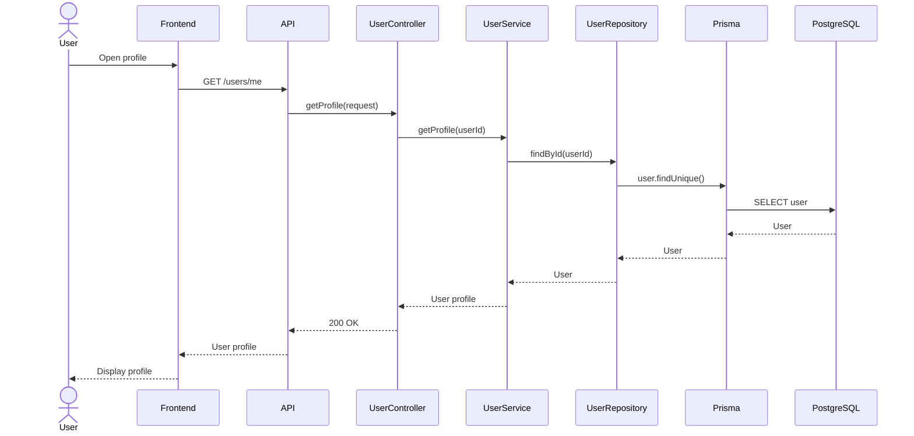

# Sequence Diagram - User - Get Profile

```mermaid
sequenceDiagram

    actor User

    participant Frontend

    participant API

    participant UserController

    participant UserService

    participant UserRepository

    participant Prisma

    participant PostgreSQL

    User->>Frontend: Open profile

    Frontend->>API: GET /users/me

    API->>UserController: getProfile(request)

    UserController->>UserService: getProfile(userId)

    UserService->>UserRepository: findById(userId)

    UserRepository->>Prisma: user.findUnique()

    Prisma->>PostgreSQL: SELECT user

    PostgreSQL-->>Prisma: User

    Prisma-->>UserRepository: User

    UserRepository-->>UserService: User

    UserService-->>UserController: User profile

    UserController-->>API: 200 OK

    API-->>Frontend: User profile

    Frontend-->>User: Display profile
```
