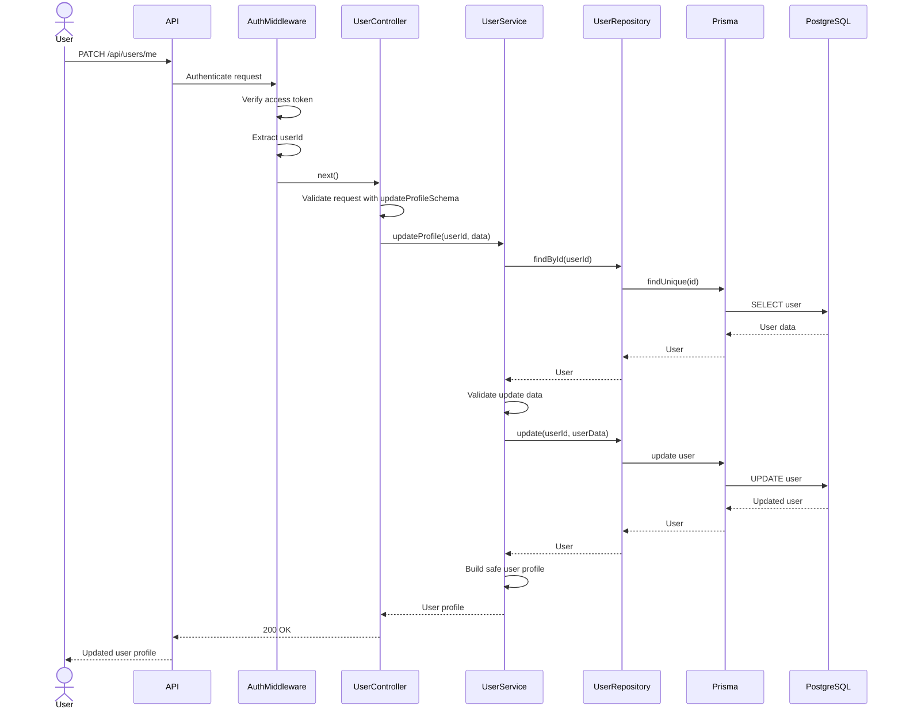

# User - Update Profile

```mermaid
sequenceDiagram
    actor User
    participant API
    participant AuthMiddleware
    participant UserController
    participant UserService
    participant UserRepository
    participant Prisma
    participant PostgreSQL

    User->>API: PATCH /api/users/me
    API->>AuthMiddleware: Authenticate request
    AuthMiddleware->>AuthMiddleware: Verify access token
    AuthMiddleware->>AuthMiddleware: Extract userId
    AuthMiddleware->>UserController: next()

    UserController->>UserController: Validate request with updateProfileSchema
    UserController->>UserService: updateProfile(userId, data)

    UserService->>UserRepository: findById(userId)
    UserRepository->>Prisma: findUnique(id)
    Prisma->>PostgreSQL: SELECT user
    PostgreSQL-->>Prisma: User data
    Prisma-->>UserRepository: User
    UserRepository-->>UserService: User

    UserService->>UserService: Validate update data
    UserService->>UserRepository: update(userId, userData)
    UserRepository->>Prisma: update user
    Prisma->>PostgreSQL: UPDATE user
    PostgreSQL-->>Prisma: Updated user
    Prisma-->>UserRepository: User
    UserRepository-->>UserService: User

    UserService->>UserService: Build safe user profile
    UserService-->>UserController: User profile
    UserController-->>API: 200 OK
    API-->>User: Updated user profile
```
