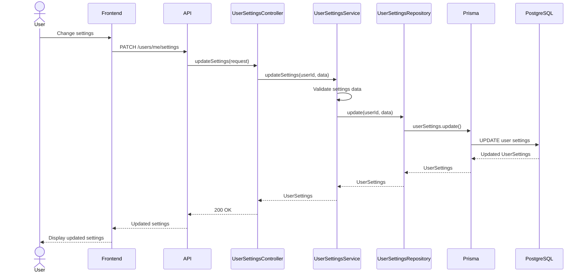

# Sequence Diagram - User/UserSettings - Update Settings

```mermaid
sequenceDiagram

    actor User

    participant Frontend

    participant API

    participant UserSettingsController

    participant UserSettingsService

    participant UserSettingsRepository

    participant Prisma

    participant PostgreSQL

    User->>Frontend: Change settings

    Frontend->>API: PATCH /users/me/settings

    API->>UserSettingsController: updateSettings(request)

    UserSettingsController->>UserSettingsService: updateSettings(userId, data)

    UserSettingsService->>UserSettingsService: Validate settings data

    UserSettingsService->>UserSettingsRepository: update(userId, data)

    UserSettingsRepository->>Prisma: userSettings.update()

    Prisma->>PostgreSQL: UPDATE user settings

    PostgreSQL-->>Prisma: Updated UserSettings

    Prisma-->>UserSettingsRepository: UserSettings

    UserSettingsRepository-->>UserSettingsService: UserSettings

    UserSettingsService-->>UserSettingsController: UserSettings

    UserSettingsController-->>API: 200 OK

    API-->>Frontend: Updated settings

    Frontend-->>User: Display updated settings
```
