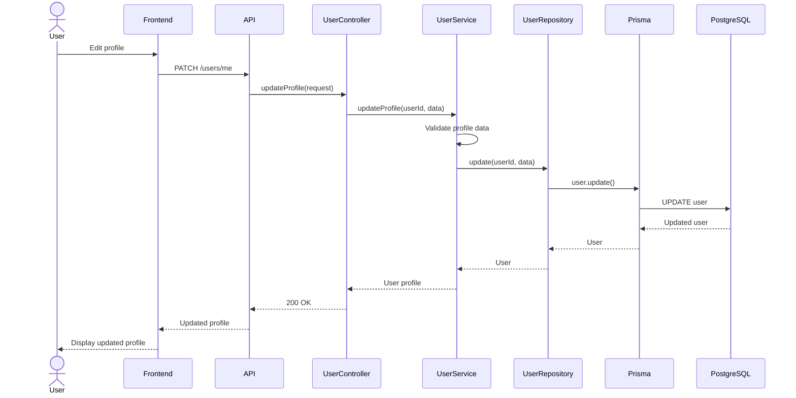

# Sequence Diagram - User - Update Profile

```mermaid
sequenceDiagram

    actor User

    participant Frontend

    participant API

    participant UserController

    participant UserService

    participant UserRepository

    participant Prisma

    participant PostgreSQL

    User->>Frontend: Edit profile

    Frontend->>API: PATCH /users/me

    API->>UserController: updateProfile(request)

    UserController->>UserService: updateProfile(userId, data)

    UserService->>UserService: Validate profile data

    UserService->>UserRepository: update(userId, data)

    UserRepository->>Prisma: user.update()

    Prisma->>PostgreSQL: UPDATE user

    PostgreSQL-->>Prisma: Updated user

    Prisma-->>UserRepository: User

    UserRepository-->>UserService: User

    UserService-->>UserController: User profile

    UserController-->>API: 200 OK

    API-->>Frontend: Updated profile

    Frontend-->>User: Display updated profile
```
