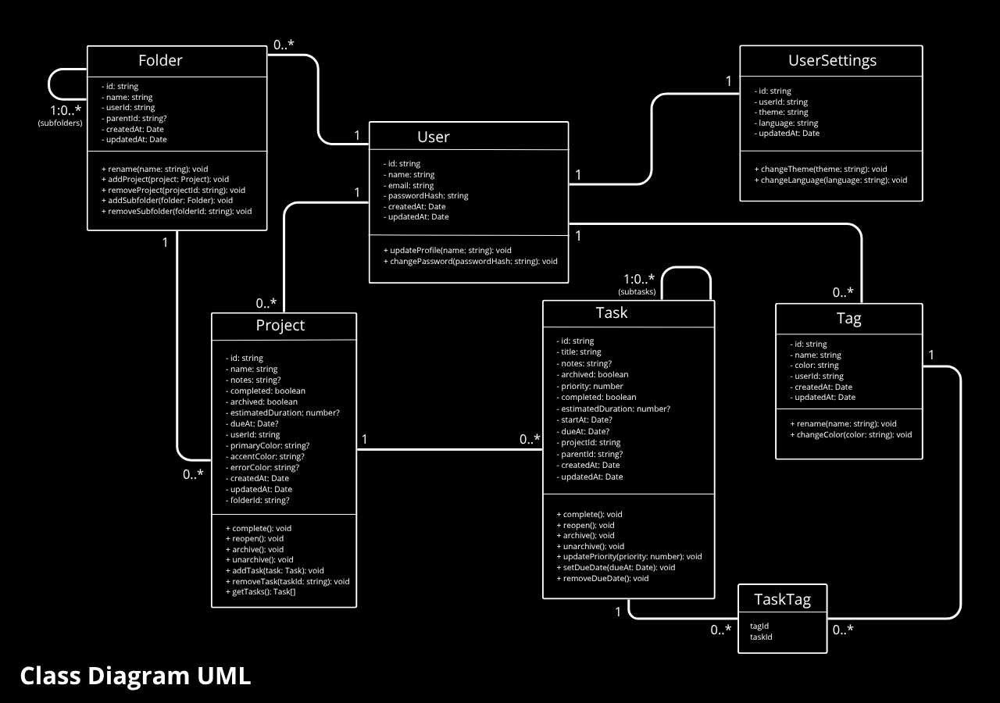
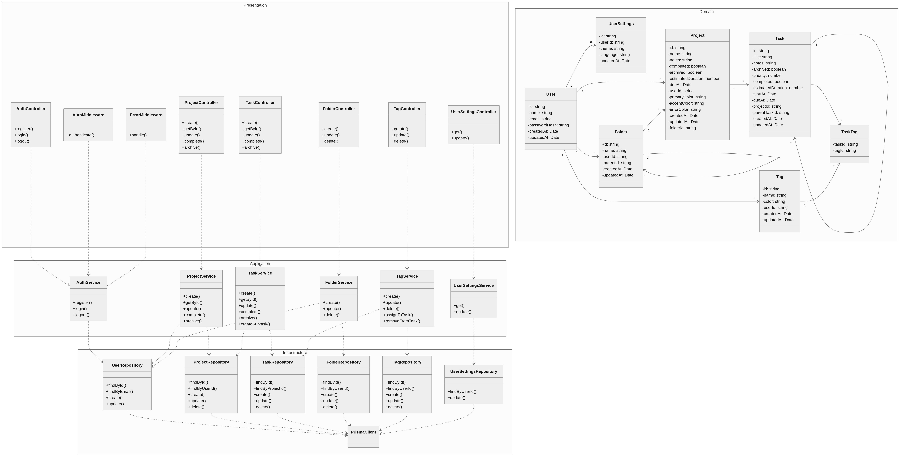
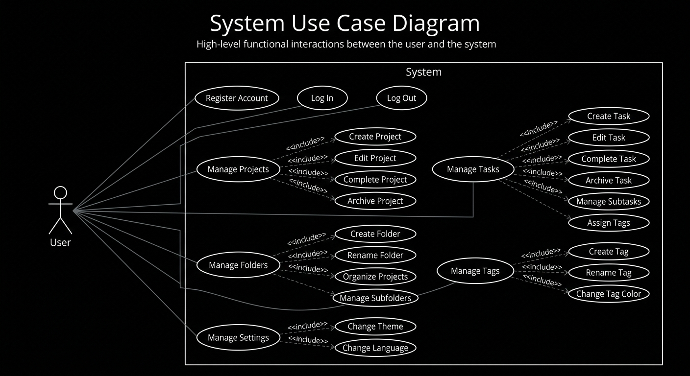

# UML Diagrams

This section contains the UML diagrams used to represent the system's structure and behavior.

UML diagrams provide visual representations of application elements, their relationships, and interactions.

## Class Diagram

The Class Diagram represents the main domain classes and their relationships within the system.

It documents the structural organization of the application's domain model.

## Application Layer Class Diagram

The Application Layer Class Diagram represents the proposed logical architecture of the application.

It illustrates the separation between the Presentation, Application, Domain, and Infrastructure layers, as well as the dependencies between controllers, services, repositories, and the Prisma client.

This diagram serves as a reference for the intended application architecture and should remain consistent with the architectural decisions defined for the project.

## Use Case Diagram

The Use Case Diagram represents the main interactions between system actors and the application's functionality.

It provides a high-level view of the functionality available to users.

## Conventions

- Diagrams should use standard UML notation where applicable.
- Diagram names should clearly identify the represented concept or architectural concern.
- Diagrams should remain consistent with the current system design.
- The Domain Class Diagram focuses on domain entities and their relationships.
- The Application Layer Class Diagram focuses on application structure and layer dependencies.
- Detailed implementation decisions should be documented separately.

Additional UML diagrams may be added as the system evolves when they provide meaningful architectural or behavioral information.
