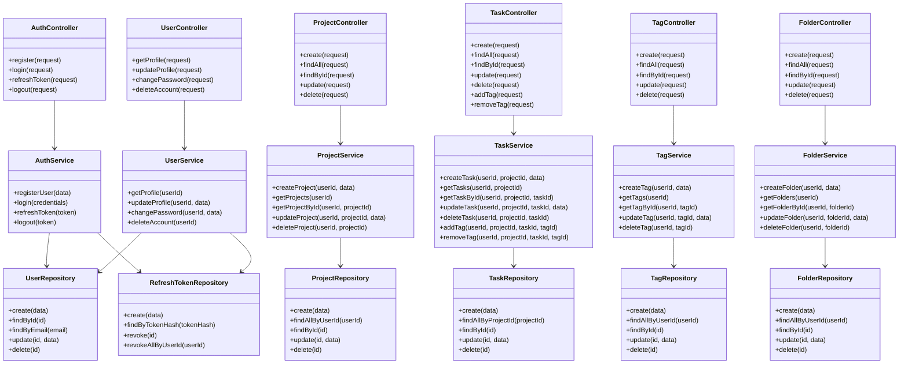

# Application Layer Class Diagram

```mermaid
classDiagram
    class AuthController {
        +register(request)
        +login(request)
        +refreshToken(request)
        +logout(request)
    }

    class UserController {
        +getProfile(request)
        +updateProfile(request)
        +changePassword(request)
        +deleteAccount(request)
    }

    class ProjectController {
        +create(request)
        +findAll(request)
        +findById(request)
        +update(request)
        +delete(request)
    }

    class TaskController {
        +create(request)
        +findAll(request)
        +findById(request)
        +update(request)
        +delete(request)
        +addTag(request)
        +removeTag(request)
    }

    class TagController {
        +create(request)
        +findAll(request)
        +findById(request)
        +update(request)
        +delete(request)
    }

    class FolderController {
        +create(request)
        +findAll(request)
        +findById(request)
        +update(request)
        +delete(request)
    }

    class AuthService {
        +registerUser(data)
        +login(credentials)
        +refreshToken(token)
        +logout(token)
    }

    class UserService {
        +getProfile(userId)
        +updateProfile(userId, data)
        +changePassword(userId, data)
        +deleteAccount(userId)
    }

    class ProjectService {
        +createProject(userId, data)
        +getProjects(userId)
        +getProjectById(userId, projectId)
        +updateProject(userId, projectId, data)
        +deleteProject(userId, projectId)
    }

    class TaskService {
        +createTask(userId, projectId, data)
        +getTasks(userId, projectId)
        +getTaskById(userId, projectId, taskId)
        +updateTask(userId, projectId, taskId, data)
        +deleteTask(userId, projectId, taskId)
        +addTag(userId, projectId, taskId, tagId)
        +removeTag(userId, projectId, taskId, tagId)
    }

    class TagService {
        +createTag(userId, data)
        +getTags(userId)
        +getTagById(userId, tagId)
        +updateTag(userId, tagId, data)
        +deleteTag(userId, tagId)
    }

    class FolderService {
        +createFolder(userId, data)
        +getFolders(userId)
        +getFolderById(userId, folderId)
        +updateFolder(userId, folderId, data)
        +deleteFolder(userId, folderId)
    }

    class UserRepository {
        +create(data)
        +findById(id)
        +findByEmail(email)
        +update(id, data)
        +delete(id)
    }

    class RefreshTokenRepository {
        +create(data)
        +findByTokenHash(tokenHash)
        +revoke(id)
        +revokeAllByUserId(userId)
    }

    class ProjectRepository {
        +create(data)
        +findAllByUserId(userId)
        +findById(id)
        +update(id, data)
        +delete(id)
    }

    class TaskRepository {
        +create(data)
        +findAllByProjectId(projectId)
        +findById(id)
        +update(id, data)
        +delete(id)
    }

    class TagRepository {
        +create(data)
        +findAllByUserId(userId)
        +findById(id)
        +update(id, data)
        +delete(id)
    }

    class FolderRepository {
        +create(data)
        +findAllByUserId(userId)
        +findById(id)
        +update(id, data)
        +delete(id)
    }

    AuthController --> AuthService
    UserController --> UserService
    ProjectController --> ProjectService
    TaskController --> TaskService
    TagController --> TagService
    FolderController --> FolderService

    AuthService --> UserRepository
    AuthService --> RefreshTokenRepository
    UserService --> UserRepository
    UserService --> RefreshTokenRepository
    ProjectService --> ProjectRepository
    TaskService --> TaskRepository
    TagService --> TagRepository
    FolderService --> FolderRepository
```
