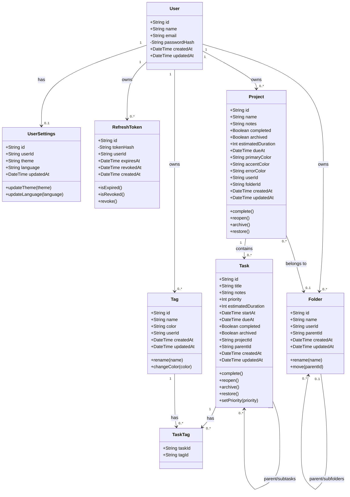

# Domain Layer Class Diagram

```mermaid
classDiagram

    class User {
        +String id
        +String name
        +String email
        -String passwordHash
        +DateTime createdAt
        +DateTime updatedAt
    }

    class UserSettings {
        +String id
        +String userId
        +String theme
        +String language
        +DateTime updatedAt

        +updateTheme(theme)
        +updateLanguage(language)
    }

    class RefreshToken {
        +String id
        -String tokenHash
        +String userId
        +DateTime expiresAt
        +DateTime revokedAt
        +DateTime createdAt

        +isExpired()
        +isRevoked()
        +revoke()
    }

    class Project {
        +String id
        +String name
        +String notes
        +Boolean completed
        +Boolean archived
        +Int estimatedDuration
        +DateTime dueAt
        +String primaryColor
        +String accentColor
        +String errorColor
        +String userId
        +String folderId
        +DateTime createdAt
        +DateTime updatedAt

        +complete()
        +reopen()
        +archive()
        +restore()
    }

    class Task {
        +String id
        +String title
        +String notes
        +Int priority
        +Int estimatedDuration
        +DateTime startAt
        +DateTime dueAt
        +Boolean completed
        +Boolean archived
        +String projectId
        +String parentId
        +DateTime createdAt
        +DateTime updatedAt

        +complete()
        +reopen()
        +archive()
        +restore()
        +setPriority(priority)
    }

    class Tag {
        +String id
        +String name
        +String color
        +String userId
        +DateTime createdAt
        +DateTime updatedAt

        +rename(name)
        +changeColor(color)
    }

    class TaskTag {
        +String taskId
        +String tagId
    }

    class Folder {
        +String id
        +String name
        +String userId
        +String parentId
        +DateTime createdAt
        +DateTime updatedAt

        +rename(name)
        +move(parentId)
    }


    User "1" --> "0..1" UserSettings : has
    User "1" --> "0..*" RefreshToken : owns
    User "1" --> "0..*" Project : owns
    User "1" --> "0..*" Tag : owns
    User "1" --> "0..*" Folder : owns

    Project "1" --> "0..*" Task : contains
    Project "0..*" --> "0..1" Folder : belongs to

    Task "0..1" --> "0..*" Task : parent/subtasks

    Task "1" --> "0..*" TaskTag : has
    Tag "1" --> "0..*" TaskTag : has

    Folder "0..1" --> "0..*" Folder : parent/subfolders
```
