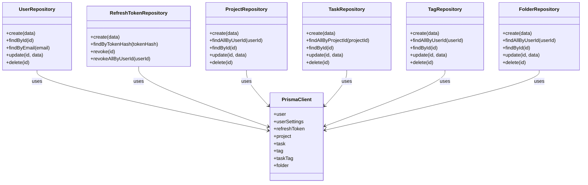

# Infrastructure Layer Class Diagram

```mermaid
classDiagram
    class PrismaClient {
        +user
        +userSettings
        +refreshToken
        +project
        +task
        +tag
        +taskTag
        +folder
    }

    class UserRepository {
        +create(data)
        +findById(id)
        +findByEmail(email)
        +update(id, data)
        +delete(id)
    }

    class RefreshTokenRepository {
        +create(data)
        +findByTokenHash(tokenHash)
        +revoke(id)
        +revokeAllByUserId(userId)
    }

    class ProjectRepository {
        +create(data)
        +findAllByUserId(userId)
        +findById(id)
        +update(id, data)
        +delete(id)
    }

    class TaskRepository {
        +create(data)
        +findAllByProjectId(projectId)
        +findById(id)
        +update(id, data)
        +delete(id)
    }

    class TagRepository {
        +create(data)
        +findAllByUserId(userId)
        +findById(id)
        +update(id, data)
        +delete(id)
    }

    class FolderRepository {
        +create(data)
        +findAllByUserId(userId)
        +findById(id)
        +update(id, data)
        +delete(id)
    }

    UserRepository --> PrismaClient : uses
    RefreshTokenRepository --> PrismaClient : uses
    ProjectRepository --> PrismaClient : uses
    TaskRepository --> PrismaClient : uses
    TagRepository --> PrismaClient : uses
    FolderRepository --> PrismaClient : uses
```
