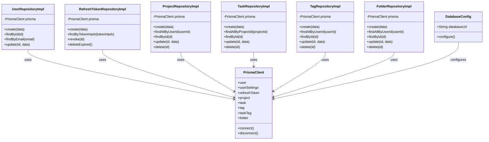

# Infrastructure Layer Class Diagram

```mermaid
classDiagram

    class PrismaClient {
        +user
        +userSettings
        +refreshToken
        +project
        +task
        +tag
        +taskTag
        +folder

        +connect()
        +disconnect()
    }

    class UserRepositoryImpl {
        -PrismaClient prisma

        +create(data)
        +findById(id)
        +findByEmail(email)
        +update(id, data)
    }

    class RefreshTokenRepositoryImpl {
        -PrismaClient prisma

        +create(data)
        +findByTokenHash(tokenHash)
        +revoke(id)
        +deleteExpired()
    }

    class ProjectRepositoryImpl {
        -PrismaClient prisma

        +create(data)
        +findAllByUserId(userId)
        +findById(id)
        +update(id, data)
        +delete(id)
    }

    class TaskRepositoryImpl {
        -PrismaClient prisma

        +create(data)
        +findAllByProjectId(projectId)
        +findById(id)
        +update(id, data)
        +delete(id)
    }

    class TagRepositoryImpl {
        -PrismaClient prisma

        +create(data)
        +findAllByUserId(userId)
        +findById(id)
        +update(id, data)
        +delete(id)
    }

    class FolderRepositoryImpl {
        -PrismaClient prisma

        +create(data)
        +findAllByUserId(userId)
        +findById(id)
        +update(id, data)
        +delete(id)
    }

    class DatabaseConfig {
        +String databaseUrl
        +configure()
    }

    UserRepositoryImpl --> PrismaClient : uses
    RefreshTokenRepositoryImpl --> PrismaClient : uses
    ProjectRepositoryImpl --> PrismaClient : uses
    TaskRepositoryImpl --> PrismaClient : uses
    TagRepositoryImpl --> PrismaClient : uses
    FolderRepositoryImpl --> PrismaClient : uses

    DatabaseConfig --> PrismaClient : configures
```
