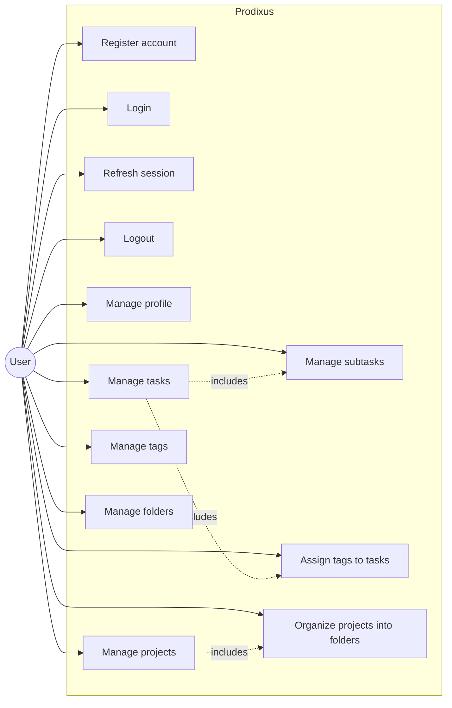

# Use Case Diagram

```mermaid
flowchart LR
    User((User))

    subgraph Prodixus["Prodixus"]
        UC1["Register account"]
        UC2["Login"]
        UC3["Refresh session"]
        UC4["Logout"]

        UC5["Manage profile"]
        UC6["Manage projects"]
        UC7["Manage tasks"]
        UC8["Manage tags"]
        UC9["Manage folders"]

        UC10["Manage subtasks"]
        UC11["Assign tags to tasks"]
        UC12["Organize projects into folders"]
    end

    User --> UC1
    User --> UC2
    User --> UC3
    User --> UC4
    User --> UC5
    User --> UC6
    User --> UC7
    User --> UC8
    User --> UC9
    User --> UC10
    User --> UC11
    User --> UC12

    UC7 -.->|includes| UC10
    UC7 -.->|includes| UC11
    UC6 -.->|includes| UC12
```
